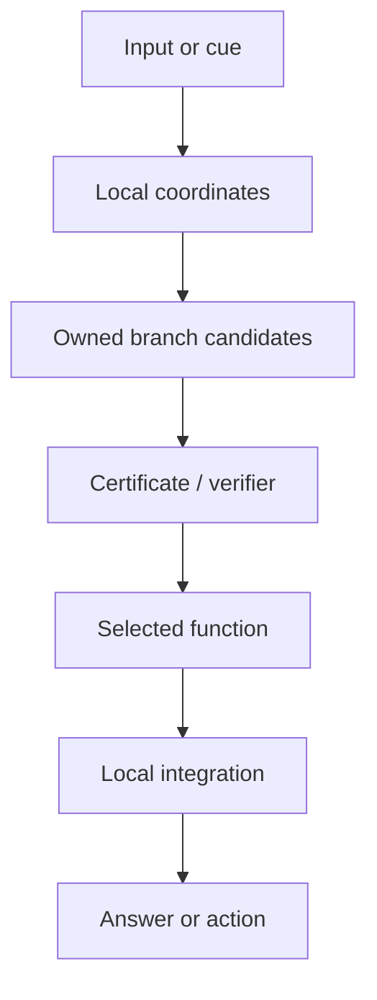

# Dendritron Complete Starter Kit

An installable reference package, experiment archive, and development scaffold for **Dendritrons**: multicompartment computational units with nonlinear local branches, routed integration, persistent local state, recursive composition, and explicit functional ownership.

> The Dendritron is the primitive. Boolean compilers, LVQ/prototype systems, mixed-geometry tissues, and Transformer memory packs are implementations of that primitive.

## Why this repository exists

The perceptron compresses its input through one shared weighted sum before applying one activation. A Dendritron can keep multiple local nonlinear compartments intact, route evidence among them, verify a local function before registration, and assemble verified units into a larger tissue without silently rewriting prior owners.

This repository makes those claims tangible. It contains:

- a small NumPy-only package with a stable API;
- exact Boolean compilation and recursive parity composition;
- bounded certificates, quarantine, functional ownership, immutable sharing, and copy-on-write;
- replay-free structural growth, local damage, and local repair;
- compartmentalized Euclidean and hyperbolic chart banks;
- functional memory packs with PPCA addressing and Fast/Efficient/Reliable/Critical recall;
- frozen-backbone hashing for Transformer adapter experiments;
- fast tests, examples, a CLI, CI, Colab material, and preserved research benchmarks.

## Architecture in one view



The package exposes four principal layers:

| Layer | Public class | Purpose |
| --- | --- | --- |
| Primitive | `Dendritron` | Nonlinear local branches plus routed integration |
| Tissue | `DendritronTissue` | Registration, quarantine, ownership, sharing, specialization, repair |
| Geometry | `MixedGeometryWeb` | Local Euclidean/hyperbolic chart banks without changing the function owner |
| Memory | `MemoryRegistry` | Address → candidates → verification → selected functional memory |

## Five-minute start

```bash
python -m venv .venv
source .venv/bin/activate
python -m pip install -e ".[dev]"
pytest
dendritron smoke
```

Windows PowerShell activation:

```powershell
.venv\Scripts\Activate.ps1
```

Run the examples:

```bash
python examples/quickstart_boolean.py
python examples/continual_plasticity.py
python examples/mixed_geometry.py
python examples/functional_memory.py
```

## Minimal example

```python
import numpy as np
from dendritron import BooleanDendritron, ParityTissue, boolean_cube

cube = boolean_cube(2)
xor = BooleanDendritron.fit(cube, cube[:, 0] ^ cube[:, 1], name="xor")

parity = ParityTissue(16, xor)
x = np.random.default_rng(7).integers(0, 2, size=(1000, 16))
assert np.all(parity(x) == x.sum(axis=1) % 2)
assert parity.node_count == 15
```

## The invariants

The reference implementations make the architecture's commitments explicit:

1. **Local nonlinearity.** A branch computes before the tissue globally collapses evidence.
2. **Functional ownership.** Every mutable branch or memory has an identifiable owner.
3. **Earned registration.** A candidate must satisfy a bounded certificate before execution.
4. **No silent interference.** Adding a new owner does not mutate registered owners.
5. **Immutable sharing and copy-on-write.** Reuse is allowed; specialization creates a fork.
6. **Geometry is routing support.** A function may use a Euclidean or hyperbolic chart without surrendering ownership.
7. **Local failure and repair.** Damage is detectable at the owner/branch level and repair need not retrain the whole system.
8. **Auditability.** Registration, quarantine, growth, geometry switches, damage, and repair are logged.

## Reference results preserved in the archive

These are recorded results from the included historical experiment lineage. The lightweight unit tests validate mechanisms; they do not silently claim to rerun the GPU benchmark.

| Experiment | Recorded result |
| --- | --- |
| Exact Boolean compilation | All bounded functions tested exactly; explicit branches equal optimized lookup |
| Recursive parity | `n - 1` two-input Dendritrons; depth `ceil(log2(n))` |
| Optical Digits | Five sequential class-incremental tasks; no task identity; local branch ownership |
| Structural plasticity | Non-destructive growth, recurrence, damage detection, and local repair |
| Mixed geometry v0.9 | Compartmentalized Euclidean 96.77%; symmetric mixed bank 98.15% mean final accuracy |
| Tree-distance limit | Depth-10 normalized RMSE: Euclidean 0.3601; hyperbolic 0.0994 |
| SmolLM2-360M v0.4.2 | Frozen base 50%; oracle adapter 97%; autonomous Dendritron 97% |
| SmolLM2 integrity | 100% old-memory retention, backbone hash retention, checkpoint equivalence, and reinstall hash equivalence; zero raw examples retained |

See [docs/EXPERIMENTS.md](docs/EXPERIMENTS.md) for the version map, commands, dependencies, and interpretation boundaries.

## Continual-learning validation (PermutedMNIST, reproduced 2026-07-19)

Independent check of the zero-forgetting claim: 10 PermutedMNIST tasks, seeds
42–44, matched parameter budget (≤269,322 params — the MLP baseline's count),
**no task identity at test time** (routing via RBF activation only), 300 frozen
branches (238,500 params). Baselines share one MLP (784-256-256-10), one data
pipeline, and the same seeds.

| Method | ACC (mean) | BWT/forgetting (mean) | Notes |
| --- | ---: | ---: | --- |
| **Dendritron tissue** | 0.673 ± .006 | **−0.056 ± .004** | structural (frozen branches), no exemplars |
| Experience replay | **0.902 ± .003** | −0.032 ± .002 | 500 exemplars/task |
| EWC | 0.766 ± .011 | −0.193 ± .013 | λ=500, diag Fisher |
| Fine-tune | 0.646 ± .012 | −0.331 ± .013 | lower bound |
| SI | 0.642 ± .028 | −0.336 ± .032 | c=0.1, ξ=1.0 |
| Joint (ceiling) | 0.956 ± .001 | 0.000 | all data at once |

**Honest reading.** The ownership claim holds — forgetting is near zero and
structural rather than regularized. But on this benchmark the tissue is
dominated by a 500-exemplar replay buffer (−0.032 BWT at +23 ACC). Its defensible
niche today: **best forgetting resistance among exemplar-free methods** (EWC/SI
forget 3.5–6× more), i.e. regimes where retaining old data is disallowed. The
0.673-vs-0.956 ACC gap is a *capacity* gap (RBF prototypes on raw pixels), not
forgetting. Also observed: the stock certificate threshold
(`minimum_accuracy=0.80`) quarantined **every** task registration here — the
tissue's certificate path needs calibration before it works at this scale, and
ownership had to be enforced via a `FrozenLocalBranch` extension.

### Recommended ablations (before claiming a continual-learning advantage)

1. **Capacity vs forgetting.** Sweep branches/task {10, 30, 60, 100} (budget
   permitting). If ACC rises toward joint while BWT stays ~−0.05, the story is
   "capacity-limited, not forgetting-limited" — a much stronger position.
2. **Oracle-routing upper bound.** Cheat: give the tissue the task id at test.
   The ACC delta vs routed mode prices the certificate-free routing exactly.
3. **Sigma sweep.** σ ∈ {0.5×, 1×, 2×} median intra-cluster distance, plus a
   per-branch learned σ — tests routing sharpness vs branch overlap.
4. **Exemplar-free regime emphasis.** Re-run where replay is *disallowed*
   (streaming/privacy). That is the only regime where the structural guarantee
   currently differentiates; make it the headline, not a footnote.
5. **Certificate calibration.** Fix the 0.80 threshold (per-task-type
   calibration or relative thresholds) so valid owners are not quarantined;
   report accept rate alongside ACC/BWT.
6. **OOD/abstention AUROC.** Train on CIFAR-10, score SVHN/LSUN:
   Σ-branch-activation as an OOD score vs MSP / energy / Mahalanobis. The RBF
   decay is the architecture's most distinctive mechanism — measure it directly.
7. **Hybrid replay.** Tissue + tiny buffer. If ACC recovers toward ~0.90 with
   BWT intact, ownership + rehearsal beats either alone and the comparison
   flips from "dominated" to "Pareto".

## Repository map

```text
dendritron-starter-kit/
├── src/dendritron/          # Installable reference package
├── tests/                   # Dependency-light contract and invariant tests
├── examples/                # Short runnable examples
├── benchmarks/archive/      # Preserved v0.1–v0.9 and Transformer experiments
├── benchmarks/results/      # Reference result summaries
├── notebooks/               # Colab/local guided start
├── configs/                 # Example experiment configurations
├── docs/                    # Architecture, equations, experiments, extension guides
└── .github/                 # CI and contribution templates
```

## Installation profiles

```bash
# Core: NumPy only
pip install -e .

# Tests and repository development
pip install -e ".[dev]"

# Archived CPU research benchmarks
pip install -e ".[research]"

# SmolLM2 / LoRA memory-pack experiment
pip install -e ".[transformer]"

# Everything, including Geoopt
pip install -e ".[all]"
```

## Transformer memory packs

The Transformer implementation uses a frozen SmolLM2-360M backbone and independently trained LoRA memory packs. Each pack contains a functional adapter, an address model, a generative verifier, and a manifest. The runtime selects candidates from the frozen hidden-state coordinate, binds with the verifier, and activates only the selected adapter.

The full v0.4.2 experiment is intentionally separate from the dependency-light package:

```bash
python benchmarks/archive/dendritron_smollm2_360m_showcase_v4_2_FINAL.py --help
```

See [docs/TRANSFORMER_MEMORY.md](docs/TRANSFORMER_MEMORY.md) before running it on an A100/Colab environment.

## Scientific scope

This repository demonstrates constructive mechanisms and recorded experiments. It does **not** claim that:

- every Dendritron realization beats every MLP;
- hyperbolic geometry should replace Euclidean geometry everywhere;
- exact truth-table compilation is efficient at unbounded local arity;
- the present synthetic benchmarks settle natural-data scale, energy, or lower-bound questions;
- the lightweight package reproduces the full 360M-parameter GPU run during unit testing.

The strongest interpretation is constructive: limitations of a single threshold unit do not transfer unchanged to a richer, locally nonlinear, recursively composable primitive.

## Contributing

Read [CONTRIBUTING.md](CONTRIBUTING.md). New realizations should preserve ownership and verification invariants, add tests, and state clearly which claims are executed versus recorded.

## Citation

Use [CITATION.cff](CITATION.cff). The architecture and benchmark lineage are attributed to Richard A. Aragon.

## License

Apache License 2.0. See [LICENSE](LICENSE).

