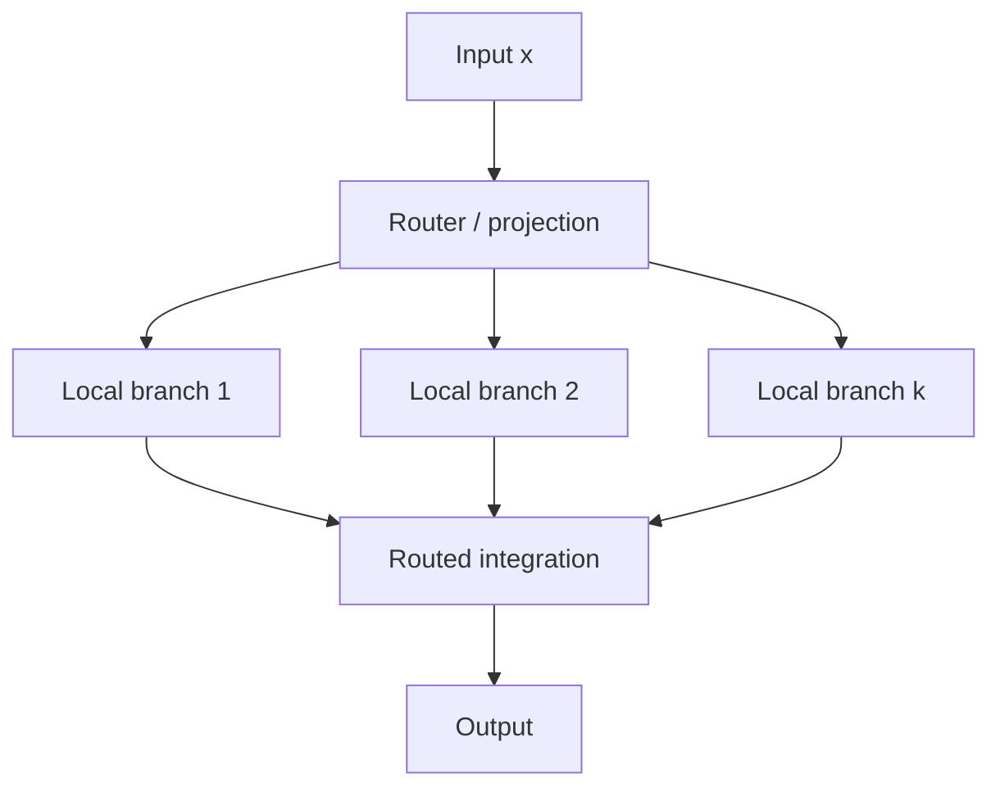
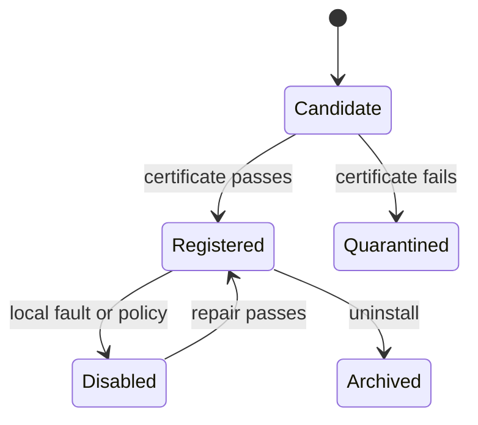

# Architecture

## Canonical unit

A Dendritron owns a set of local branches. A branch receives a local projection, applies a nonlinear response, retains local state, and contributes evidence to an integration rule. Routing determines which branches or charts are evaluated. Ownership determines which function is allowed to mutate them.

This is not merely a wide hidden layer. The architectural contract is that branches can be admitted, verified, owned, disabled, repaired, shared, and specialized as explicit units.

## Tissue

`DendritronTissue` is an explicit registry of functional owners. A candidate passes through:

Immutable regions may serve multiple consumers. Specialization uses copy-on-write: clone the region, change the clone, verify it with a new certificate, and leave the original hash unchanged.

## Geometry-typed routing

A local chart is `(projection, metric, curvature, scale)`. A branch may keep a chart bank and select the chart that creates the smallest ownership-certificate violation. Euclidean charts are appropriate for locally isotropic discrimination; hyperbolic charts are often appropriate for hierarchy, ancestry, and tree-distance certificates.

The critical distinction is:

> Geometry is a routing property, not functional ownership.

Switching a chart changes how evidence reaches a branch. It does not grant that branch permission to overwrite a different function.

## Functional memory

The Transformer realization follows:

`cue → frozen coordinate → address scores → candidate set → generative verification → selected pack → output`

A memory pack bundles:

- functional module (for example, a LoRA adapter);
- address model;
- generative verifier;
- validation score and manifest;
- content and backbone-integrity hashes.

Fast, Efficient, Reliable, and Critical modes form a compute/reliability dial by varying the candidate set, not by changing the stored function.

